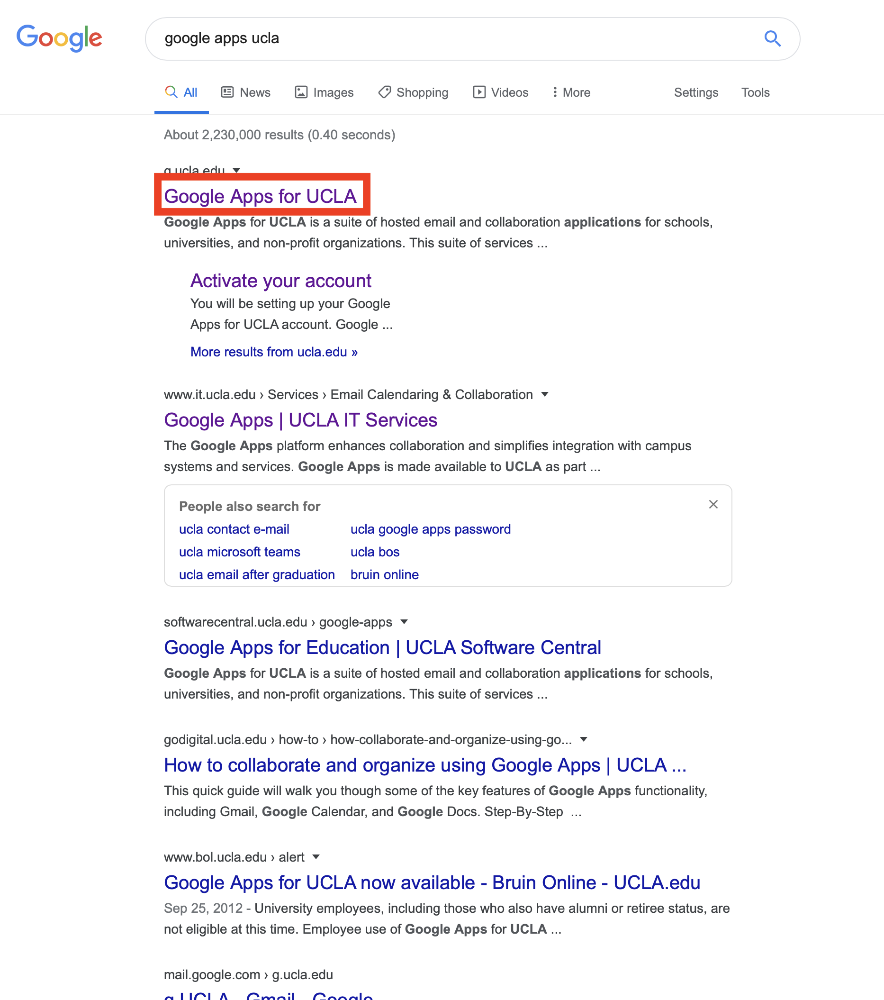
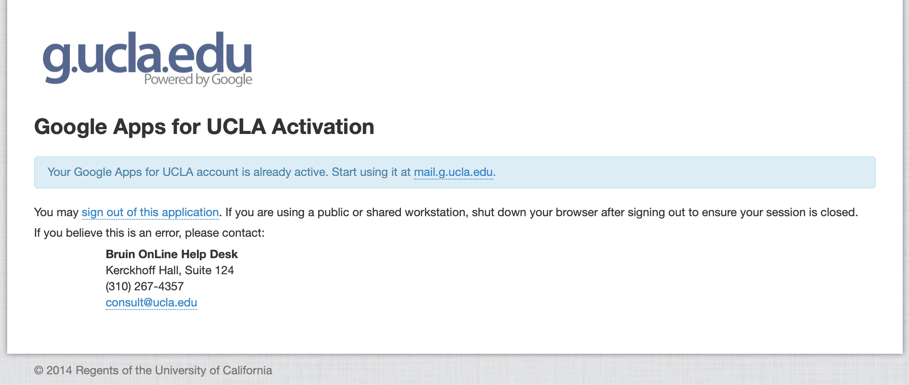
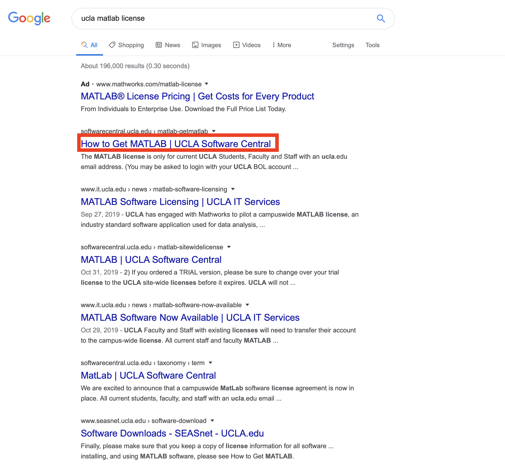
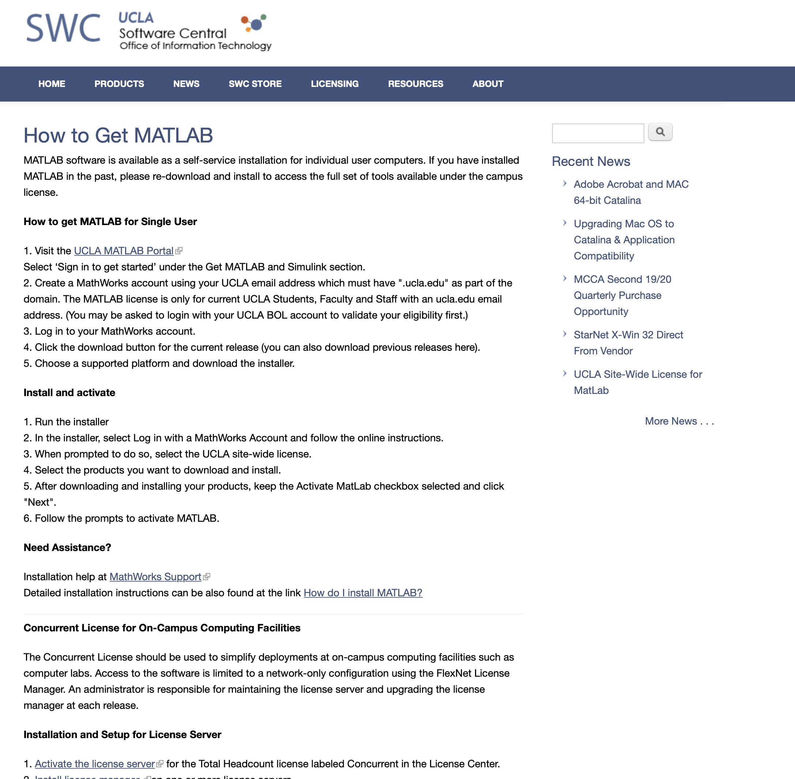

This tutorial will explain step-by-step how to get your FREE Matlab license and install matlab software on your local computer. 

# Step 1: Activate your UCLA email account
If you already have an activated UCLA email account, please jump to step 2. Technically, your email account should have been automatically activated after the first time you signed up your UCLA logon ID and the address should be _yourlogonID@g.ucla.edu_. If you don't know how to sign in or would like to confirm, launch Google and type "Google apps for UCLA", then click "search". You will see something like:
<figure class="image">
  
</figure>
After clicking the first link (the one in red box), you will be directed to its official page:
<figure class="image">
  
</figure>
Click the "Sign in with your UCLA Logon ID" botton and then log in to UCLA system same as the way you log in CCLE or MyUCLA. Then, you will get the confirmation message displayed in the middle of the page:
<figure class="image">
  
</figure>
If you have any problem or error, please contact the help desk as soon as possible because you need this .edu email address to activate your Matlab license later.

# Step 2: Go to UCLA Software Center and Follow the Instructions
Search "ucla matlab license" on google, and then click the link for UCLA Software Center. 
<figure class="image">
  
</figure>
Or, click this link: <https://softwarecentral.ucla.edu/matlab-getmatlab>, then you will see a very detailed instruction:
<figure class="image">
  
</figure>
Follow this instruction and you will be good. Notice that you don't need to install any external packages/toolboxes. We will just use general matlab data types and operations in this course. The external packages are for advanced development and analysis which you will need in your future work or researches. They are out of scope of this course.